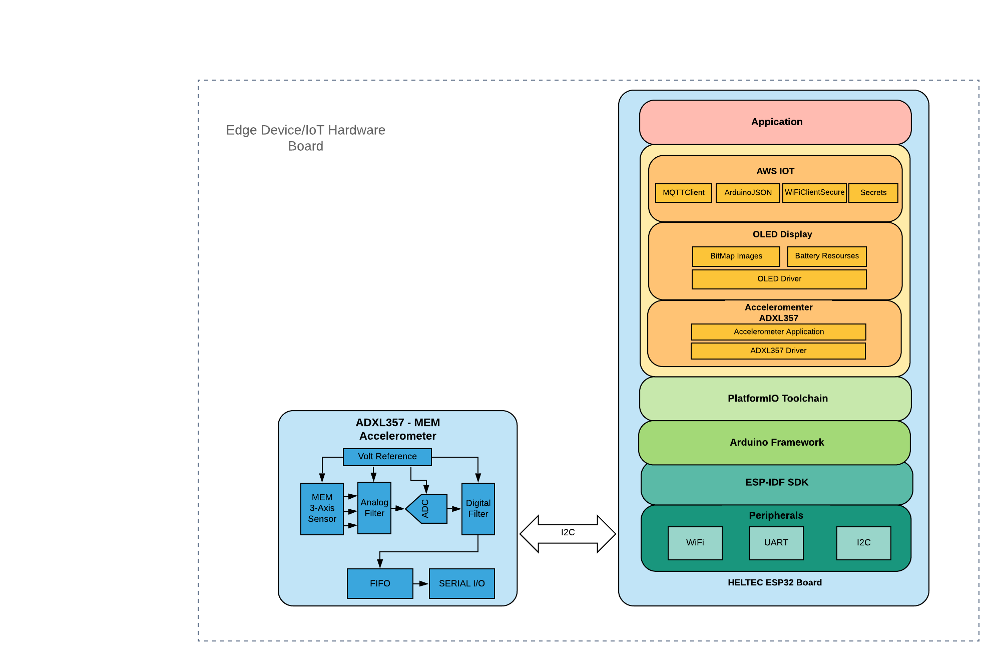
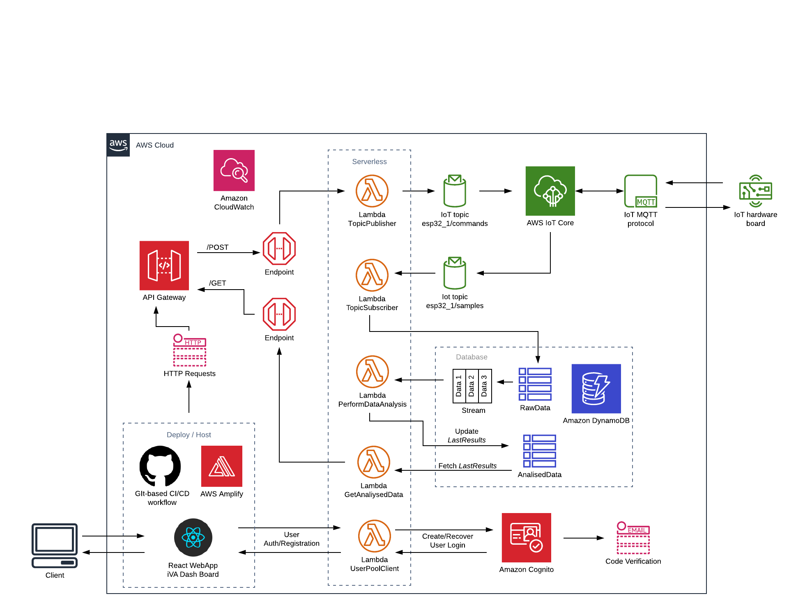

## Final Year Project - GMIT 2020

This repository contains the source code for iVA (intelligent Vibration Analyser) 

---

## Edge Device/IoT hardware board layer diagram

**EVAL ADXL357 3-Axis Acceleromenter - Heltec Wifi Kit 32 (ESP32)**

## System Architecture Diagram

**AWS Cloud Architecture Diagram - IoT core / React FrontEnd / Serverless Backend**

	
---
